# 🎓 Sistema de Cursos - Guía Frontend

## 📋 Índice
1. [Gestión de Cursos (Instructores/Organizaciones)](#gestión-de-cursos-instructoresorganizaciones)
2. [Consumo de Cursos (Estudiantes)](#consumo-de-cursos-estudiantes)
3. [Componentes Reutilizables](#componentes-reutilizables)
4. [Flujos de Usuario](#flujos-de-usuario)

---

# 🏢 Gestión de Cursos (Instructores/Organizaciones)

## 🎯 **Funcionalidades Principales**

### 📝 **Creación y Edición de Cursos**

#### **1. Formulario de Creación de Curso**
```typescript
interface CourseFormData {
  // Información básica
  title: string;
  slug: string;
  description: string;
  shortDescription?: string;
  level: 'BEGINNER' | 'INTERMEDIATE' | 'ADVANCED';
  category: 'SOFT_SKILLS' | 'BASIC_COMPETENCIES' | 'JOB_PLACEMENT' | 'ENTREPRENEURSHIP' | 'TECHNICAL_SKILLS' | 'DIGITAL_LITERACY' | 'COMMUNICATION' | 'LEADERSHIP';
  duration: number; // en minutos
  price: number;
  
  // Arrays
  objectives: string[];
  prerequisites: string[];
  tags: string[];
  includedMaterials: string[];
  
  // Configuración
  isActive: boolean;
  certification: boolean;
  isMandatory: boolean;
  
  // Archivos
  thumbnail?: File; // Imagen de portada
  videoPreview?: File; // Video de presentación
}
```

#### **2. Subida de Archivos**
```typescript
// Subir imagen de portada y video de presentación
const uploadCourseFiles = async (courseId: string, files: {
  thumbnail?: File;
  videoPreview?: File;
}) => {
  const formData = new FormData();
  
  if (files.thumbnail) {
    formData.append('thumbnail', files.thumbnail);
  }
  if (files.videoPreview) {
    formData.append('videoPreview', files.videoPreview);
  }
  
  const response = await fetch(`/api/course/${courseId}`, {
    method: 'PUT',
    headers: {
      'Authorization': `Bearer ${token}`
    },
    body: formData
  });
  
  return response.json();
};
```

### 📚 **Gestión de Módulos**

#### **1. Crear Módulo**
```typescript
interface ModuleFormData {
  courseId: string;
  title: string;
  description?: string;
  orderIndex: number;
  estimatedDuration: number; // en minutos
  prerequisites: string[];
  hasCertificate: boolean;
  certificateTemplate?: string;
}
```

#### **2. Lista de Módulos**
```typescript
const getCourseModules = async (courseId: string) => {
  const response = await fetch(`/api/coursemodule?courseId=${courseId}`, {
    headers: { 'Authorization': `Bearer ${token}` }
  });
  return response.json();
};
```

### 📖 **Gestión de Lecciones**

#### **1. Crear Lección**
```typescript
interface LessonFormData {
  moduleId: string;
  title: string;
  description?: string;
  content: string;
  contentType: 'VIDEO' | 'TEXT' | 'QUIZ' | 'ASSIGNMENT' | 'LIVE';
  videoUrl?: string; // URL de YouTube o archivo local
  duration?: number; // en minutos
  orderIndex: number;
  isRequired: boolean;
  isPreview: boolean;
}
```

#### **2. Agregar Recursos a Lecciones**
```typescript
interface LessonResourceFormData {
  lessonId: string;
  title: string;
  description?: string;
  type: 'PDF' | 'DOCUMENT' | 'VIDEO' | 'AUDIO' | 'IMAGE' | 'LINK' | 'ZIP' | 'OTHER';
  url?: string; // Para enlaces externos
  file?: File; // Para archivos locales
  orderIndex: number;
  isDownloadable: boolean;
}

const uploadLessonResource = async (data: LessonResourceFormData) => {
  const formData = new FormData();
  
  // Campos de texto
  formData.append('lessonId', data.lessonId);
  formData.append('title', data.title);
  formData.append('type', data.type);
  formData.append('orderIndex', data.orderIndex.toString());
  formData.append('isDownloadable', data.isDownloadable.toString());
  
  if (data.description) {
    formData.append('description', data.description);
  }
  
  if (data.url) {
    formData.append('url', data.url);
  }
  
  if (data.file) {
    formData.append('file', data.file);
  }
  
  const response = await fetch('/api/lessonresource', {
    method: 'POST',
    headers: { 'Authorization': `Bearer ${token}` },
    body: formData
  });
  
  return response.json();
};
```

### 📊 **Seguimiento de Progreso**

#### **1. Ver Progreso de Estudiantes**
```typescript
const getStudentProgress = async (courseId: string) => {
  const response = await fetch(`/api/lessonprogress/course/${courseId}`, {
    headers: { 'Authorization': `Bearer ${token}` }
  });
  return response.json();
};
```

#### **2. Estadísticas del Curso**
```typescript
interface CourseStats {
  totalStudents: number;
  activeStudents: number;
  completedStudents: number;
  averageProgress: number;
  averageCompletionTime: number;
  moduleCompletionRates: {
    moduleId: string;
    moduleTitle: string;
    completionRate: number;
  }[];
}
```

### 🏆 **Gestión de Certificados**

#### **1. Generar Certificados de Módulo**
```typescript
const generateModuleCertificate = async (moduleId: string, studentId: string) => {
  const response = await fetch('/api/modulecertificate', {
    method: 'POST',
    headers: {
      'Authorization': `Bearer ${token}`,
      'Content-Type': 'application/json'
    },
    body: JSON.stringify({
      moduleId,
      studentId,
      certificateUrl: 'https://example.com/certificate.pdf', // URL del certificado generado
      grade: 95 // Calificación del módulo
    })
  });
  
  return response.json();
};
```

## 🎨 **Interfaces de Usuario**

### **1. Dashboard de Instructor**
```typescript
// Componente principal del dashboard
const InstructorDashboard = () => {
  return (
    <div className="instructor-dashboard">
      <header>
        <h1>Panel de Instructor</h1>
        <button onClick={() => navigate('/courses/create')}>
          Crear Nuevo Curso
        </button>
      </header>
      
      <div className="stats-grid">
        <StatCard title="Cursos Activos" value={activeCourses} />
        <StatCard title="Estudiantes Totales" value={totalStudents} />
        <StatCard title="Certificados Emitidos" value={certificatesIssued} />
        <StatCard title="Ingresos" value={`$${totalRevenue}`} />
      </div>
      
      <div className="recent-courses">
        <h2>Cursos Recientes</h2>
        <CourseList courses={recentCourses} />
      </div>
    </div>
  );
};
```

### **2. Editor de Curso**
```typescript
const CourseEditor = ({ courseId }: { courseId: string }) => {
  return (
    <div className="course-editor">
      <Tabs>
        <Tab label="Información General">
          <CourseInfoForm course={course} onSave={updateCourse} />
        </Tab>
        
        <Tab label="Módulos">
          <ModuleManager courseId={courseId} />
        </Tab>
        
        <Tab label="Estudiantes">
          <StudentProgress courseId={courseId} />
        </Tab>
        
        <Tab label="Certificados">
          <CertificateManager courseId={courseId} />
        </Tab>
      </Tabs>
    </div>
  );
};
```

---

# 👨‍🎓 Consumo de Cursos (Estudiantes)

## 🎯 **Funcionalidades Principales**

### 🔍 **Exploración de Cursos**

#### **1. Catálogo de Cursos**
```typescript
interface CourseCatalog {
  courses: Course[];
  filters: {
    level: string[];
    category: string[];
    price: { min: number; max: number };
    duration: { min: number; max: number };
  };
  pagination: {
    page: number;
    limit: number;
    total: number;
  };
}

const getCourseCatalog = async (filters?: CourseFilters) => {
  const params = new URLSearchParams();
  if (filters) {
    Object.entries(filters).forEach(([key, value]) => {
      if (value) params.append(key, value.toString());
    });
  }
  
  const response = await fetch(`/api/course?${params}`);
  return response.json();
};
```

#### **2. Vista Previa de Curso**
```typescript
const CoursePreview = ({ courseId }: { courseId: string }) => {
  const [course, setCourse] = useState<Course | null>(null);
  
  useEffect(() => {
    fetch(`/api/course/${courseId}/preview`)
      .then(res => res.json())
      .then(setCourse);
  }, [courseId]);
  
  if (!course) return <Loading />;
  
  return (
    <div className="course-preview">
      <div className="course-header">
        
        <div className="course-info">
          <h1>{course.title}</h1>
          <p>{course.description}</p>
          <div className="course-meta">
            <span>Nivel: {course.level}</span>
            <span>Duración: {formatDuration(course.duration)}</span>
            <span>Precio: ${course.price}</span>
          </div>
        </div>
      </div>
      
      {course.videoPreview && (
        <div className="video-preview">
          <video controls src={course.videoPreview} />
        </div>
      )}
      
      <div className="course-content">
        <h2>Lo que aprenderás</h2>
        <ul>
          {course.objectives.map((objective, index) => (
            <li key={index}>{objective}</li>
          ))}
        </ul>
        
        <h2>Requisitos</h2>
        <ul>
          {course.prerequisites.map((prereq, index) => (
            <li key={index}>{prereq}</li>
          ))}
        </ul>
      </div>
      
      <button onClick={() => enrollInCourse(courseId)}>
        Inscribirse al Curso
      </button>
    </div>
  );
};
```

### 📚 **Inscripción y Acceso**

#### **1. Inscribirse en Curso**
```typescript
const enrollInCourse = async (courseId: string) => {
  const response = await fetch('/api/courseenrollment', {
    method: 'POST',
    headers: {
      'Authorization': `Bearer ${token}`,
      'Content-Type': 'application/json'
    },
    body: JSON.stringify({
      courseId,
      enrollmentDate: new Date().toISOString()
    })
  });
  
  return response.json();
};
```

#### **2. Mi Biblioteca de Cursos**
```typescript
const MyCourses = () => {
  const [enrollments, setEnrollments] = useState<CourseEnrollment[]>([]);
  
  useEffect(() => {
    fetch('/api/courseenrollment', {
      headers: { 'Authorization': `Bearer ${token}` }
    })
      .then(res => res.json())
      .then(setEnrollments);
  }, []);
  
  return (
    <div className="my-courses">
      <h1>Mis Cursos</h1>
      
      <div className="courses-grid">
        {enrollments.map(enrollment => (
          <CourseCard
            key={enrollment.id}
            course={enrollment.course}
            progress={enrollment.progress}
            onContinue={() => navigate(`/course/${enrollment.courseId}`)}
          />
        ))}
      </div>
    </div>
  );
};
```

### 🎥 **Reproductor de Videos**

#### **1. Reproductor con Seguimiento de Progreso**
```typescript
const VideoPlayer = ({ lessonId, videoUrl }: { lessonId: string; videoUrl: string }) => {
  const [progress, setProgress] = useState(0);
  const [isCompleted, setIsCompleted] = useState(false);
  
  const handleTimeUpdate = (currentTime: number, duration: number) => {
    const newProgress = currentTime / duration;
    setProgress(newProgress);
    
    // Actualizar progreso en el servidor cada 30 segundos
    if (Math.floor(currentTime) % 30 === 0) {
      updateLessonProgress(lessonId, {
        videoProgress: newProgress,
        timeSpent: currentTime,
        isCompleted: newProgress >= 0.9 // 90% = completado
      });
    }
  };
  
  const handleVideoEnd = () => {
    setIsCompleted(true);
    updateLessonProgress(lessonId, {
      videoProgress: 1.0,
      isCompleted: true
    });
  };
  
  return (
    <div className="video-player">
      <video
        src={videoUrl}
        controls
        onTimeUpdate={(e) => {
          const video = e.target as HTMLVideoElement;
          handleTimeUpdate(video.currentTime, video.duration);
        }}
        onEnded={handleVideoEnd}
      />
      
      <div className="progress-bar">
        <div 
          className="progress-fill" 
          style={{ width: `${progress * 100}%` }}
        />
      </div>
      
      {isCompleted && (
        <div className="completion-badge">
          ✅ Lección Completada
        </div>
      )}
    </div>
  );
};
```

### 📖 **Navegación del Curso**

#### **1. Vista de Módulos y Lecciones**
```typescript
const CourseView = ({ courseId }: { courseId: string }) => {
  const [course, setCourse] = useState<Course | null>(null);
  const [currentLesson, setCurrentLesson] = useState<Lesson | null>(null);
  
  return (
    <div className="course-view">
      <div className="course-sidebar">
        <h2>{course?.title}</h2>
        
        <div className="modules-list">
          {course?.modules.map(module => (
            <ModuleAccordion
              key={module.id}
              module={module}
              onLessonSelect={setCurrentLesson}
            />
          ))}
        </div>
      </div>
      
      <div className="lesson-content">
        {currentLesson ? (
          <LessonView lesson={currentLesson} />
        ) : (
          <CourseWelcome course={course} />
        )}
      </div>
    </div>
  );
};
```

#### **2. Recursos de Lección**
```typescript
const LessonResources = ({ lessonId }: { lessonId: string }) => {
  const [resources, setResources] = useState<LessonResource[]>([]);
  
  useEffect(() => {
    fetch(`/api/lessonresource?lessonId=${lessonId}`)
      .then(res => res.json())
      .then(setResources);
  }, [lessonId]);
  
  return (
    <div className="lesson-resources">
      <h3>Recursos de la Lección</h3>
      
      <div className="resources-list">
        {resources.map(resource => (
          <ResourceCard
            key={resource.id}
            resource={resource}
            onDownload={() => downloadResource(resource)}
          />
        ))}
      </div>
    </div>
  );
};
```

### 📊 **Seguimiento de Progreso**

#### **1. Progreso del Curso**
```typescript
const CourseProgress = ({ courseId }: { courseId: string }) => {
  const [progress, setProgress] = useState<CourseProgress | null>(null);
  
  useEffect(() => {
    fetch(`/api/lessonprogress/course/${courseId}`, {
      headers: { 'Authorization': `Bearer ${token}` }
    })
      .then(res => res.json())
      .then(setProgress);
  }, [courseId]);
  
  if (!progress) return <Loading />;
  
  return (
    <div className="course-progress">
      <div className="progress-overview">
        <h2>Progreso del Curso</h2>
        <div className="progress-circle">
          <CircularProgress
            value={progress.overallProgress}
            size={120}
            thickness={8}
          />
          <span className="progress-text">
            {Math.round(progress.overallProgress)}%
          </span>
        </div>
      </div>
      
      <div className="progress-details">
        <div className="stat">
          <span>Lecciones Completadas</span>
          <strong>{progress.completedLessons} / {progress.totalLessons}</strong>
        </div>
        
        <div className="stat">
          <span>Tiempo Dedicado</span>
          <strong>{formatDuration(progress.totalTimeSpent)}</strong>
        </div>
      </div>
      
      <div className="modules-progress">
        {progress.modules.map(module => (
          <ModuleProgressCard key={module.id} module={module} />
        ))}
      </div>
    </div>
  );
};
```

### 🏆 **Certificados**

#### **1. Mis Certificados**
```typescript
const MyCertificates = () => {
  const [certificates, setCertificates] = useState<ModuleCertificate[]>([]);
  
  useEffect(() => {
    fetch('/api/modulecertificate', {
      headers: { 'Authorization': `Bearer ${token}` }
    })
      .then(res => res.json())
      .then(setCertificates);
  }, []);
  
  return (
    <div className="my-certificates">
      <h1>Mis Certificados</h1>
      
      <div className="certificates-grid">
        {certificates.map(certificate => (
          <CertificateCard
            key={certificate.id}
            certificate={certificate}
            onDownload={() => downloadCertificate(certificate)}
          />
        ))}
      </div>
    </div>
  );
};
```

## 🎨 **Componentes Reutilizables**

### **1. CourseCard**
```typescript
interface CourseCardProps {
  course: Course;
  progress?: number;
  onContinue?: () => void;
  onEnroll?: () => void;
}

const CourseCard = ({ course, progress, onContinue, onEnroll }: CourseCardProps) => {
  return (
    <div className="course-card">
      
      
      <div className="course-info">
        <h3>{course.title}</h3>
        <p>{course.shortDescription}</p>
        
        <div className="course-meta">
          <span className="level">{course.level}</span>
          <span className="duration">{formatDuration(course.duration)}</span>
          <span className="price">${course.price}</span>
        </div>
        
        {progress !== undefined && (
          <div className="progress-bar">
            <div 
              className="progress-fill" 
              style={{ width: `${progress}%` }}
            />
            <span>{Math.round(progress)}% completado</span>
          </div>
        )}
        
        <div className="course-actions">
          {progress !== undefined ? (
            <button onClick={onContinue} className="btn-continue">
              Continuar
            </button>
          ) : (
            <button onClick={onEnroll} className="btn-enroll">
              Inscribirse
            </button>
          )}
        </div>
      </div>
    </div>
  );
};
```

### **2. ProgressIndicator**
```typescript
interface ProgressIndicatorProps {
  current: number;
  total: number;
  showPercentage?: boolean;
  size?: 'small' | 'medium' | 'large';
}

const ProgressIndicator = ({ 
  current, 
  total, 
  showPercentage = true, 
  size = 'medium' 
}: ProgressIndicatorProps) => {
  const percentage = (current / total) * 100;
  
  return (
    <div className={`progress-indicator ${size}`}>
      <div className="progress-bar">
        <div 
          className="progress-fill" 
          style={{ width: `${percentage}%` }}
        />
      </div>
      
      {showPercentage && (
        <span className="progress-text">
          {Math.round(percentage)}%
        </span>
      )}
    </div>
  );
};
```

## 🔄 **Flujos de Usuario**

### **1. Flujo de Creación de Curso**

```mermaid
graph TD
    A[Instructor accede al dashboard] --> B[Click en 'Crear Curso']
    B --> C[Llenar información básica]
    C --> D[Subir imagen de portada]
    D --> E[Subir video de presentación]
    E --> F[Crear módulos]
    F --> G[Agregar lecciones a cada módulo]
    G --> H[Subir recursos a las lecciones]
    H --> I[Publicar curso]
    I --> J[Curso disponible para estudiantes]
```


### **2. Flujo de Consumo de Curso**

```mermaid
graph TD
    A[Estudiante explora catálogo] --> B[Selecciona curso]
    B --> C[Ve preview del curso]
    C --> D[Se inscribe al curso]
    D --> E[Accede al contenido]
    E --> F[Ve lecciones en orden]
    F --> G[Reproduce videos]
    G --> H[Progreso se guarda automáticamente]
    H --> I[Completa módulo]
    I --> J[Recibe certificado de módulo]
    J --> K[Continúa con siguiente módulo]
    K --> L[Completa todo el curso]
    L --> M[Recibe certificado final]
```


## 📱 **Responsive Design**

### **1. Breakpoints**
```scss
// Mobile First
$mobile: 320px;
$tablet: 768px;
$desktop: 1024px;
$large: 1440px;

// Mixins
@mixin mobile {
  @media (min-width: $mobile) { @content; }
}

@mixin tablet {
  @media (min-width: $tablet) { @content; }
}

@mixin desktop {
  @media (min-width: $desktop) { @content; }
}
```

### **2. Layout Adaptativo**
```typescript
const CourseLayout = () => {
  const isMobile = useMediaQuery('(max-width: 768px)');
  
  return (
    <div className={`course-layout ${isMobile ? 'mobile' : 'desktop'}`}>
      {isMobile ? (
        <MobileCourseView />
      ) : (
        <DesktopCourseView />
      )}
    </div>
  );
};
```

---

## 🚀 **Próximas Mejoras Frontend**

- [ ] **Modo offline** para descargar contenido
- [ ] **Notificaciones push** de progreso
- [ ] **Chat en vivo** durante lecciones
- [ ] **Foros de discusión** por módulo
- [ ] **Gamificación** con badges y puntos
- [ ] **Analytics** detallados para instructores
- [ ] **Descarga masiva** de recursos
- [ ] **Subtítulos** en videos
- [ ] **Accesibilidad** mejorada
- [ ] **Tema oscuro** opcional

---

**¡El sistema está listo para crear experiencias de aprendizaje completas y atractivas!** 🎓✨
